# Node AI Development Tool

> **The node-based AI development workbench — drag, drop, and ship.**
> Turn "AI programming" into a visual canvas: from a one-line requirement to generated images, written code, reviewed & tested output, and a packaged `.exe` / web app / Android APK / Godot game — **all on one canvas**.

[English](./README.md) · [简体中文](./README.zh-CN.md)

---

## Demo (2-minute walkthrough)

A real recorded session inside the app — canvas, nodes, per-node AI/agent badge, image workspace and model settings:

<video src="screenshots/demo-walkthrough.mp4" controls="controls" style="max-width: 100%; border-radius: 8px;"></video>

---

## What is this?

**Node AI Development Tool** breaks complex AI development into a node graph. Each node is one AI action — project, feature, review, test, image, video understanding, packaging, quality gate… — and the connections define the data flow. One click runs the whole pipeline with live progress.

The underlying model is isomorphic with **ComfyUI** — but ComfyUI only generates images. This tool ships **software, apps, and games**: Windows `.exe`, static web apps, Android `.apk`, and Godot game projects.

Two independent workspaces (pages) live side by side:

| Workspace | What it does |
| --- | --- |
| **App Builder** (`软件制作`) | The application-development pipeline: project → feature → review → test → output. A fully node-based programming canvas. |
| **Image Generation** (`生图`) | A ComfyUI-style image workflow: positive prompt / negative prompt / sampler / image output. A fully node-based image canvas. |
| **Handoff node** (in both) | Collects images produced in the image workspace into one asset manifest and hands them to software nodes — **image ↔ software cooperation built in**. |

## Screenshots (real UI, v0.6.6)

**Main canvas — app builder workspace with a live 3-node workflow:**

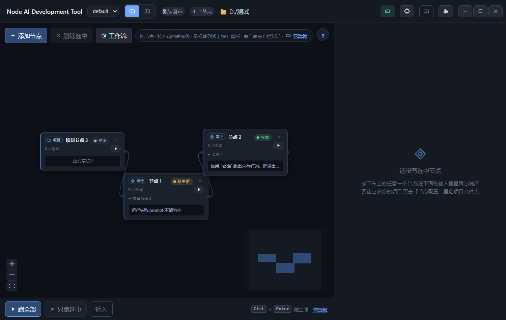

**Every node shows its own AI agent + model badge** (click a node → the right inspector also shows it, and you can change it per node):

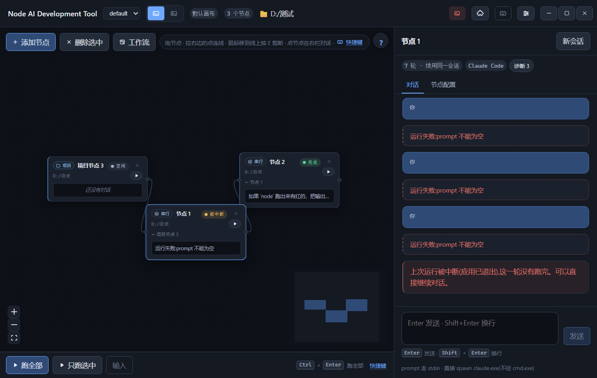

**Add-node menu** (scrollable — all node types reachable):

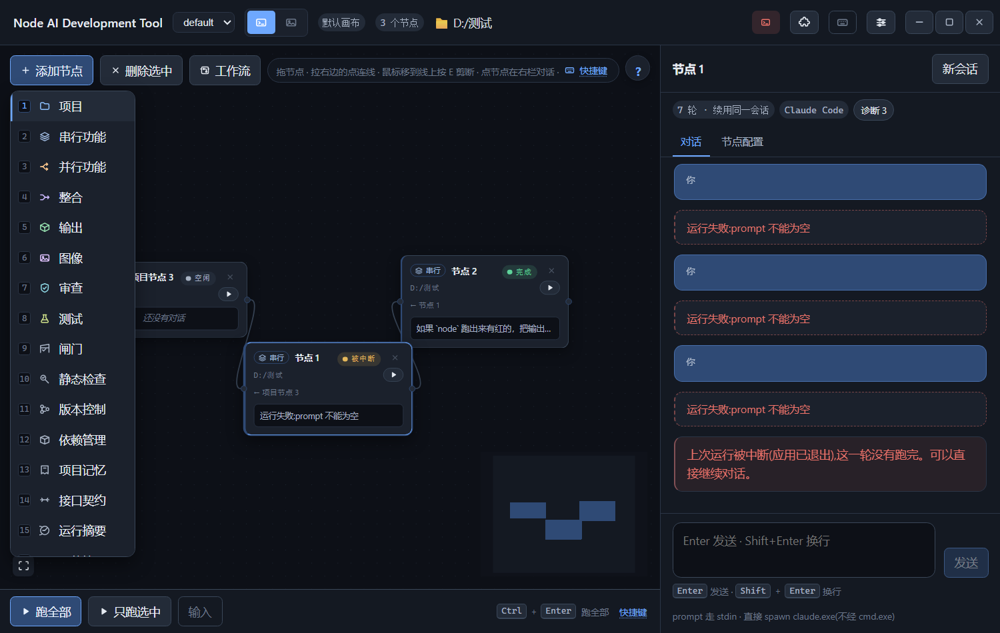

**Node config panel** (per-node agent / prompt / project folder / params):

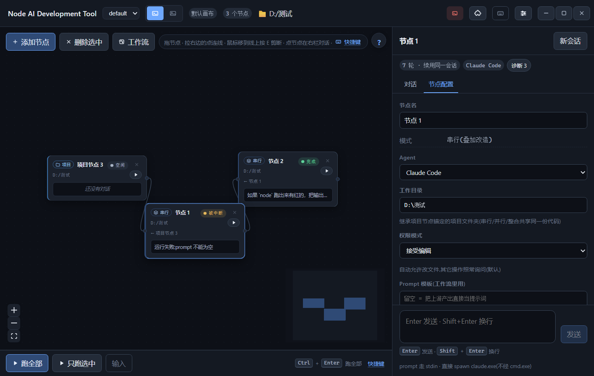

**Image workspace** — the ComfyUI-style page (positive / negative prompt → sampler → output):

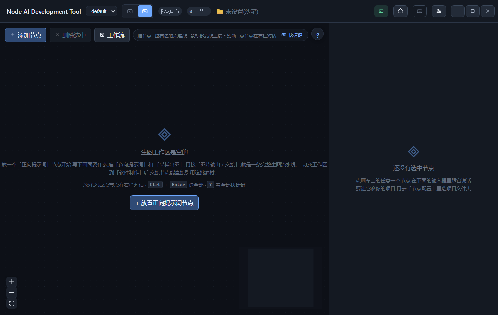

**Model services & settings** (API providers, one-click probe & auto-select, local models):

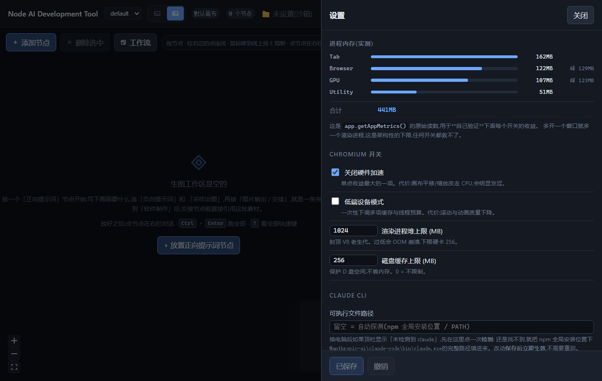

## Example output: a pixel-dungeon asset pack

A complete set of game assets generated **by a local image model** inside the image workspace (scene / hero / ghost / slime / skeleton / items / UI), then handed into an app via the handoff node:

| Scene | Hero | Ghost |
| --- | --- | --- |
| 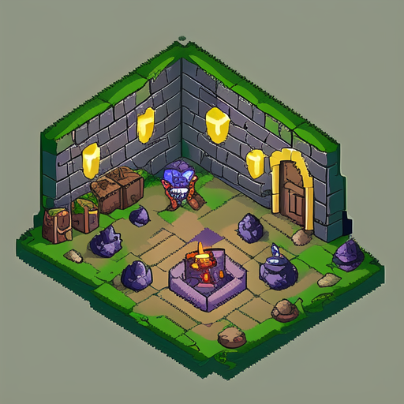 | 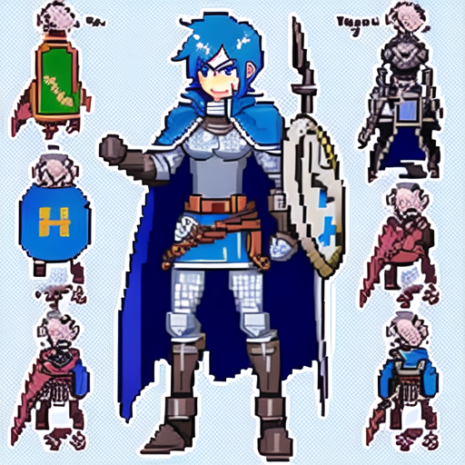 | 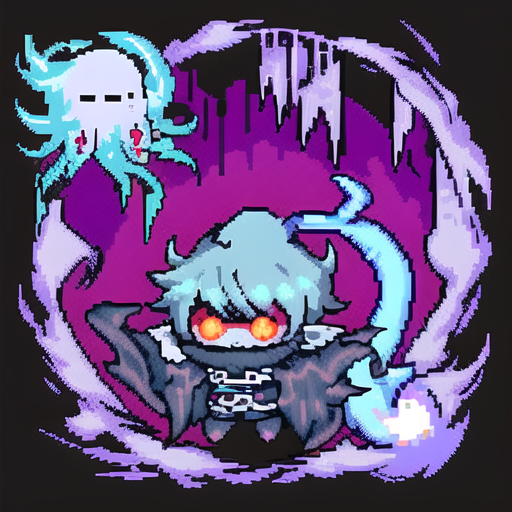 |

| Slime | Skeleton | Items | UI |
| --- | --- | --- | --- |
| 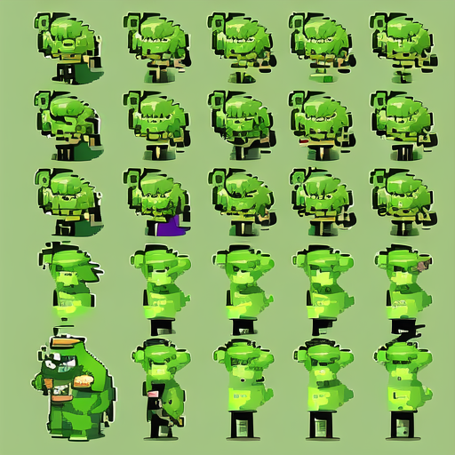 | 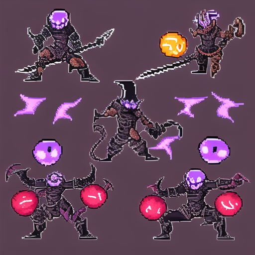 | 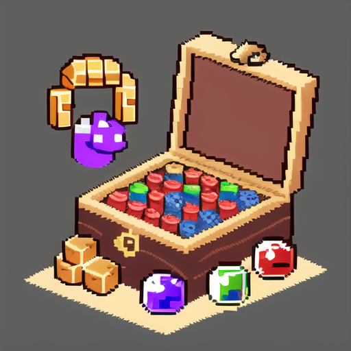 | 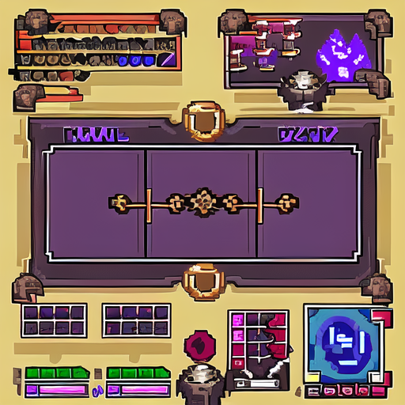 |

The pack below is one more full sample rendered by a local model (`anything-v5` checkpoint, no SD WebUI service running):

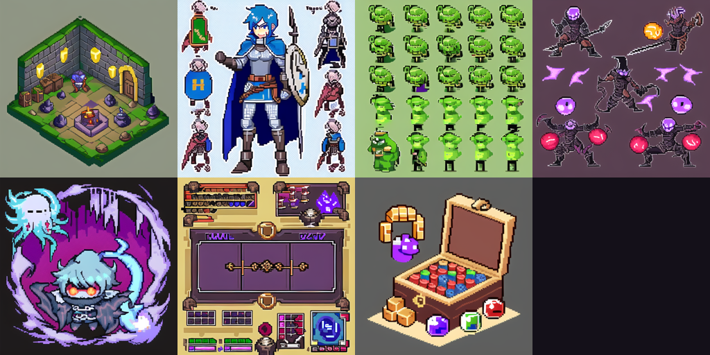

## Why this exists

| Capability | Details |
| --- | --- |
| **Node canvas** | Drag-and-drop dev pipelines: serial / parallel / merge / subgraphs, with live progress visualization |
| **Dual workspaces** | **App Builder** and **Image Generation** as two independent pages with per-project canvases |
| **Per-node AI & agent** | **Every node card shows which agent + model it runs on**, and each node can be configured to use a different AI / agent (defaults inherit from global settings) |
| Multi-model access | One-click probe & auto-select across API providers (Ark / OpenAI / Anthropic / Ollama / LM Studio / local CLI agents); plug in local open-source LLMs with zero API key |
| Local image generation | The image node loads a local checkpoint directly with diffusers (e.g. Anything V5) — **no SD WebUI service, no extra window, no server**. SD WebUI can be uninstalled |
| Handoff node | Collects images from image nodes into one asset manifest and hands them to software nodes |
| Video understanding | A video node extracts frames, analyzes them with a vision model, and turns "what's in the video" into text for downstream nodes |
| **Multi-platform packaging** | Output node ships **Windows `.exe`**, **Web static sites** (PWA-ready), **Android `.apk`** (Capacitor + Gradle; auto-degrades to a Web bundle when no SDK is detected), and **Godot game zips** — one workflow, four targets |
| Feedback loop | **Run → fail → fix → re-run**: Gate node (exit-code / text / regex checks), Auto-Fix (errors fed back to the LLM automatically), 8 deterministic engineering nodes (zero LLM tokens) |
| **Engineering-grade agent orchestration** | **Agent (loop)** node iterates one role over multiple rounds (auto-stops on a completion marker); **Router** node lets the LLM activate exactly one outgoing branch while others auto-skip — real conditional workflows |
| **Chart (visualization) node** | Renders upstream JSON into an SVG chart (bar / line / pie / scatter / funnel) via ECharts SSR; ships with the packaged app |
| **Open-source skill marketplace** | Install any public GitHub / Gitee skill repo by URL (domain allowlist + zip-slip protection + dangerous-command scanning), plus curated official skill packs (anthropics/skills, obra/superpowers) |
| Workflow import / export | Save any canvas as a `.json` workflow file and restore it later (ComfyUI-style); share workflows as files |
| Built-in templates | One-click pipelines: desktop app (exe) / mobile & web app / pixel game / full image workflow / **agent-orchestration** |
| Game creation | A game node makes AI produce a complete Godot project (delivered as a zip) |
| MCP Server | Claude / Cursor can orchestrate workflows headlessly (`npm run mcp`) |
| Quality gates | Review (read-only audit) / test (run commands) / doc nodes for a closed quality loop |

## One full pipeline

```
[Project] → [Feature (generates Electron app)] → [Review] → [Test] → [Gate] → [Output (exe)]
                ↑
[Image node (local model → UI/icons)] → [Handoff node (asset manifest)]
```

AI generates the application code from your requirement while the local model renders UI assets in parallel; the handoff node feeds asset paths into software nodes; the output node packages everything into a runnable `.exe`.

## The complete node list

**App-builder workspace (`软件制作`)** — every node can be assigned its own AI agent + model:

- **Project** — the project folder + one-line requirement (entry point).
- **Feature** — generate / modify code with an agent (serial or parallel modes).
- **Review** — read-only code audit by an AI reviewer.
- **Test** — run commands / a test suite in the project.
- **Gate** — deterministic check point: exit-code mode or text (contains / not-contains / regex) mode; failure blocks everything downstream.
- **Output** — package to `.exe` / web / `.apk` / Godot zip.
- **Image** — generate images (local model direct or API).
- **Handoff** — collect image-node outputs into an asset manifest for software nodes.
- **Game** — generate a complete Godot project.
- **Video** — extract frames + vision analysis → text summary.
- **Doc** — write documentation from upstream output.
- **Agent (loop)** — one role, many rounds; stops on a completion marker.
- **Router** — LLM decision point: activates exactly one outgoing branch.
- **Chart** — ECharts SSR → SVG from JSON data.
- **Python** — run arbitrary Python scripts in the project dir (subprocess, cwd-locked, no tokens).
- **Subgraph** — group nodes into a reusable sub-flow.
- **Merge** — combine parallel branches.
- **Engineering nodes (v0.6.6, deterministic, zero tokens):** `lint` (tsc/any command) · `git` (status/commit/log/branch) · `deps` (dependency report & missing detection) · `context` (project memory → `context.md`) · `contract` (extract API routes → `openapi.yaml`) · `cost` (run summary & token estimate) · `diff` (project snapshot) · `deploy` (one-click deploy folder with vercel.json / netlify.toml).

**Image workspace (`生图`)** — a ComfyUI-style workflow:

- **Positive prompt** — what you want (with preset & strength).
- **Negative prompt** — what to avoid.
- **Sampler** — model + params (local checkpoint / API / SD WebUI-compatible local command).
- **Image output** — saves to `assets/generated/` and can also feed the **Handoff** node.
- **Handoff** — passes images to the app-builder workspace.

## Feedback loop & engineering toolkit

From "one-way pipeline" to **run → fail → fix → re-run**:

- **Gate node** — a check point on the chain: `exit` mode runs a command and checks the exit code; `text` mode validates upstream output (contains / not-contains / regex). Fail = node fails and everything downstream is blocked.
- **Auto-Fix** — enable `autofix` on a feature/agent node; whenever a downstream gate/test fails, the error is fed back to the LLM and that sub-chain re-runs (bounded by `maxRounds`).
- **Node-level error visualization** — failed nodes show the error summary right on the canvas, with a one-click `fix` button that creates a connected repair node.
- **Incremental execution** — unchanged inputs reuse the previous run's output (input-hash based, zero-cost re-runs).
- **Undo / redo** — every canvas edit is reversible.

## Agent orchestration & visualization (v0.6.x)

**Agent (loop) node** — one role, many rounds: the first round uses the normal prompt template; later rounds continue the conversation with the previous output until the reply contains the completion marker (`doneHint`) or `maxRounds` is reached. Great for "plan → iterate → self-check" loops.

**Router node** — LLM decision point: after reading upstream results, the model picks one outgoing branch (by number or label); the picked branch runs, all others auto-skip. Wire 2+ outgoing edges, optionally label them (`routes`), and a conditional workflow appears.

**Chart node** — drop JSON data (or upstream output via `{{input}}`) into the data template, pick a chart type (bar / line / pie / scatter / funnel), and an SVG is rendered by ECharts SSR and saved to `assets/generated/charts/<title>-<ts>/chart.svg`. Reference the relative path in docs and it ships with the packaged app.

Try the **agent-orchestration** built-in template: project → planning agent → two parallel execution agents → merge → reviewer agent → output exe.

## Getting started

```bash
npm install          # installs dependencies (electron comes pre-cached)
npm run dev          # launch the app (dev mode)
```

1. Drag in a **Project** node, set the project folder and a one-line requirement;
2. Configure models: Settings → Model Services → paste an API key, or start a local model (Ollama / LM Studio). **One-click probe auto-picks the model** — paste your API key, hit probe, and the first responding model is selected automatically (no more guessing among a dozen versions);
3. Assign each node its own AI agent & model if you like (defaults inherit from global settings);
4. Wire up your node graph → hit Run → watch each node execute and outputs land on disk.

### Recommended prompt for the feature node (Electron exe)

```
Generate an Electron application that can be packaged directly into a Windows exe:
package.json (main pointing to main.js, build.win.target set to portable) + main.js + index.html,
with the UI referencing image assets under the project's assets/ via relative paths.
```

## Local models — no API key needed

**Local LLMs:** add a provider pointing at Ollama / LM Studio (`http://localhost:11434` etc.) — the probe will list your local models and auto-select the working one. CLI agents (e.g. Claude Code) are also detected and can run per node.

**Local image generation (no SD server):** set the image node's provider to **Local Command**, pointing at `scripts/txt2img.py`:

```bash
python scripts/txt2img.py \
  --prompt-file prompt.txt --out ./output \
  --n 1 --size 512x512 --seed 42 --negative "blurry, low quality"
```

- Model: env var `CHUSIZ_SD_CHECKPOINT` points to any `.safetensors` base model (default `models/anything-v5.safetensors`);
- Negative prompt can also be injected via `CANVAS_NEGATIVE_PROMPT`;
- Because the image node generates directly with diffusers, **SD WebUI is not required — you can uninstall it**;
- One-click local service control (legacy SD WebUI bundles): `npm run sd:status | sd:start | sd:stop`.

## Packaging

```bash
npm run dist         # builds the installer → dist/node-ai-development-tool-0.6.6-setup.exe
npm run icon         # regenerates the app icon
```

The **Output** node produces: Windows `.exe` (direct), Web static site (PWA-ready zip / folder), Android `.apk` (via Capacitor + Gradle when SDK is present, otherwise auto-degrades to a Web bundle), Godot game zip.

## Open-source skill marketplace

The skills drawer now has a **Marketplace** tab:

- Paste any public repo URL — `https://github.com/owner/repo` or `…/tree/main/<subdir>` (GitHub / Gitee) — and click Install;
- Curated packs: **anthropics/skills** (official office/search/research skills) and **obra/superpowers** install in one click;
- Security: domain allowlist → zip-slip protection → dangerous-command scan (`rm -rf`, `curl | sh`, …) with warnings before anything lands in your skill library;
- Multi-skill repos install all skills at once.

## MCP Server (headless orchestration)

`npm run mcp` starts a JSON-RPC-over-stdio server (`list_nodes` / `run_workflow` / `get_node_result`) using the exact same scheduler as the GUI — Claude, Cursor, or any MCP client can orchestrate your workflows.

## Tests

```bash
npm run e2e          # full regression suite (1277 passed / 10 skipped / 0 failed — LLM, packaging, image, video, handoff, agent orchestration, chart, skill market)
npm run typecheck:node && npm run typecheck:web
```

## Environment variables

| Variable | Purpose |
| --- | --- |
| `ARK_API_KEY` | Volcano Ark API key (verification scripts) |
| `CHUSIZ_SD_CHECKPOINT` | Local image-generation base model (`.safetensors` path) |
| `CHUSIZ_SD_PYTHON` | Extracted Python runtime (direct-generation mode) |
| `CHUSIZ_SD_WEBUI_ROOT` | SD WebUI bundle detection root |
| `CANVAS_NEGATIVE_PROMPT` | Default negative prompt for image generation |

## Repository layout

```
src/
  main/           # Main process: workflow scheduling, built-in action executors (packaging/image/test/video/handoff), local services
  shared/         # Node registry, canvas graph, workflow spec (single source of truth for types)
  renderer/       # React canvas UI: node components, config panels, run panel
scripts/
  e2e.ts          # Full regression suite
  txt2img.py      # Local direct generation (diffusers loading a checkpoint)
  sd-local.ts     # Local SD service status/start/stop
docs/
  ARCHITECTURE.md # Architecture & plugin design
  PLUGIN.md       # Node plugin authoring guide
  ROADMAP.md      # Engineering trust → platform capability → ecosystem
```

## Roadmap

See [ROADMAP.md](./docs/ROADMAP.md) — engineering trust → platform capability → ecosystem. Picked highlights: node plugin SDK, Human Approval / Policy / Secrets Vault / Rollback nodes, budget & cost control, parallel-agent voting, release & deploy pipeline, and an "AI software factory" quality-gate loop.

## License

[MIT](./LICENSE) — use, modify, and distribute freely; keep the copyright notice.

## Contributing

All contributions welcome: issues, bug fixes, new node types, docs. See [CONTRIBUTING.md](./CONTRIBUTING.md) and [CODE_OF_CONDUCT.md](./CODE_OF_CONDUCT.md).

---

## A note from the author

> This project started as a personal experiment: can a node canvas make AI programming *visible* — and can it ship real software, not just demos? It has grown far beyond what one person can finish alone.
>
> **This project is waiting for the right person (or people) to take it further.** Every issue, PR, new node type, template or translation moves it forward. If you've ever thought "AI coding tools should work more like this" — this is the place. The roadmap is open, the code is MIT, and the door is wide open.
>
> 这个项目始于一个个人实验：能否用一张节点画布让 AI 编程**看得见**——并且真正交付软件，而不只是演示？它已经长成了一个人无法独自完成的样子。
>
> **这个项目等待有缘人（或有缘的团队）继续完善它。** 每一个 issue、PR、新节点、新模板、新翻译，都在把它推进一步。如果你也曾想过"AI 编程工具就该长这样"——这里就是起点。路线图公开、代码 MIT、大门敞开。
>
> — chusiz, the author

## Changelog highlights

- **v0.6.6 (2026-10-08):** engineering node group (lint / git / deps / context / contract / cost / diff / deploy) + UI polish — E-key edge cutting, icon-only top bar, per-node AI/agent badge on every node card.
- **v0.6.5:** feedback loop — Gate node + Auto-Fix + node-level error visualization + incremental execution.
- **v0.6.4:** artifact preview in-app, security audit before packaging, MCP Server, Python node, lazy loading, governance docs.
- **v0.6.3:** cross-platform e2e, 3 golden workflow templates, roadmap doc.
- **v0.6.x earlier:** agent orchestration (loop / router), chart node, skill marketplace, dual workspaces, local image generation, handoff, multi-platform packaging.
