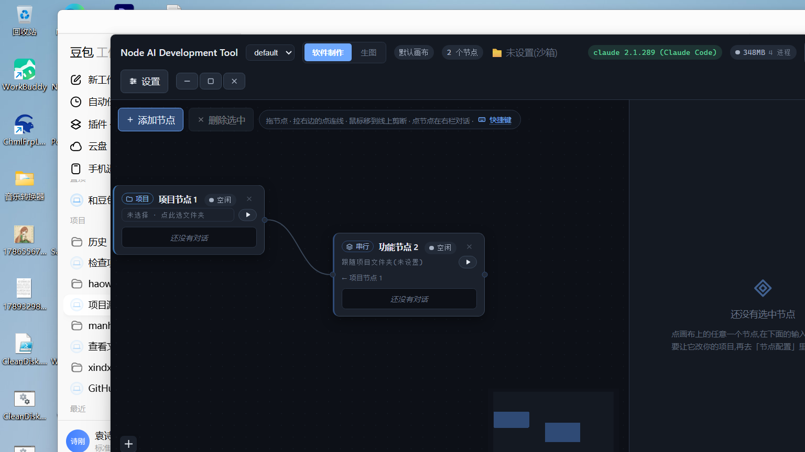

# Node AI Development Tool

> **Node-based AI development workbench — turn "AI programming" into a drag-and-drop node canvas.**
> From a one-line requirement to generated images, written code, and a packaged `.exe` — all on the canvas.

[English](./README.md) | [简体中文](./README.zh-CN.md)



Break complex AI development into a node graph. Each node is one AI action (project / feature / review / test / image / video understanding / packaging). Connections define the data flow, and one click runs the whole pipeline. The underlying model is isomorphic with **ComfyUI** — but ComfyUI only generates images. This tool ships **software, apps, and games**.

## Why this exists

| What | Details |
| --- | --- |
| Node canvas | Drag-and-drop dev pipelines: serial / parallel / merge / subgraphs, with live progress visualization |
| **Dual workspaces** | **App Builder** and **Image Generation** as two independent pages. The image page is a full image workflow (positive / negative prompt → sampler → output); the app page is the application-development pipeline |
| Multi-model access | One-click probe & auto-select across API providers; plug in local open-source LLMs (Ollama / LM Studio) with zero API key |
| Local image generation | The image node loads a local checkpoint directly with diffusers (e.g. Anything V5) — **no SD WebUI service, no extra window, no server** |
| Handoff node | Collects images produced by image nodes into a single asset manifest and hands them directly to downstream software nodes |
| Video understanding | A video node extracts frames, analyzes them with a vision model, and turns "what's in the video" into text for downstream nodes |
| **Multi-platform packaging** | The output node ships **Windows `.exe`**, **Web static sites** (PWA-ready, phone browser friendly), **Android `.apk`** (via Capacitor + Gradle; auto-degrades to a Web app bundle when no SDK is detected), and **Godot game zips** — one workflow, four targets |
| Workflow import / export | Save any canvas as a `.json` workflow and restore it later (ComfyUI-style); share workflows as files |
| Built-in templates | One-click pipelines: desktop app (exe), mobile/web app, pixel game, a full image-generation workflow, and an **agent-orchestration** template |
| **Engineering-grade agent orchestration** | An **Agent (loop)** node iterates the same role over multiple rounds (auto-stops on a completion marker); a **Router** node lets the LLM read upstream results and activate exactly one outgoing branch while others auto-skip — real conditional workflows |
| **Chart (visualization) node** | Renders upstream JSON data into an SVG chart (bar / line / pie / scatter / funnel) via ECharts SSR; the SVG is saved under `assets/generated/charts/` and ships with the packaged app |
| **Open-source skill marketplace** | Install any public GitHub / Gitee skill repo by URL (with domain allowlist, zip-slip protection, and dangerous-command scanning), plus curated official skill packs (anthropics/skills, obra/superpowers) |
| Game creation | A game node makes AI produce a complete Godot project (delivered as a zip) |
| Quality gates | Review (read-only audit) / test (run commands) / doc nodes for a closed quality loop |

## One full pipeline

```
[Project] → [Feature (generates Electron app)] → [Review] → [Test] → [Output (exe)]
                ↑
[Image node (local model → UI/icons)] → [Handoff node (asset manifest)]
```

AI generates the application code from your requirement while the local model renders UI assets in parallel; the handoff node feeds asset paths into software nodes; the output node packages everything into a runnable `.exe`.

## Image workspace (a ComfyUI-style page)

The image page does exactly one thing: a **complete image-generation workflow** — Positive Prompt node / Negative Prompt node / Sampler node / Image Output node, paired with a local model or API provider.

```
[Positive prompt (what you want)] ──→ [Sampler (model + params)] ──→ [Image output (saved to assets/generated/)]
[Negative prompt (what to avoid)] ──┘
```


Above: a pixel-dungeon game asset pack (scenes / characters / monsters / UI / items) generated by a local model in the image workspace, then embedded into an app via the handoff node.

## Agent orchestration & visualization (v0.6.x)

**Agent (loop) node** — one role, many rounds: first round uses the normal prompt template; later rounds continue the conversation with the previous output until the reply contains the completion marker (`doneHint`) or `maxRounds` is reached. Great for "plan → iterate → self-check" loops.

**Router node** — LLM decision point: after reading upstream results, the model picks one outgoing branch (by number or label); the picked branch runs, all others auto-skip. Wire 2+ outgoing edges, optionally label them (`routes`), and a conditional workflow appears.

**Chart node** — drop JSON data (or upstream output via `{{input}}`) into the data template, pick a chart type (bar / line / pie / scatter / funnel), and an SVG is rendered by ECharts SSR and saved to `assets/generated/charts/<title>-<ts>/chart.svg`. Reference the relative path in docs, and it ships with the packaged app.

Try the **agent-orchestration** built-in template: project → planning agent → two parallel execution agents → merge → reviewer agent → output exe.

## Feedback loop & engineering toolkit (v0.6.5 / v0.6.6)

**Run → fail → fix → re-run**, no longer a one-way pipeline:

- **Gate node** — a check point on the chain: `exit` mode runs a command and checks the exit code, `text` mode validates the upstream output (contains / not-contains / regex). Fail = the node fails and everything downstream is blocked.
- **Auto-Fix** — enable `autofix` on a feature/agent node and, whenever a downstream gate/test fails, the error is fed back to the LLM and that sub-chain re-runs (bounded by `maxRounds`).
- **8 deterministic engineering nodes** (zero LLM tokens):
  - `lint` — static check (`npx tsc --noEmit` or any command; exit code decides pass/fail);
  - `git` — local version control (`status` / `commit` with auto local identity / `log` / `branch`; never pushes);
  - `deps` — dependency report & missing detection (auto-detects npm `package.json` / pip `requirements.txt`);
  - `context` — project memory (style / conventions / interface list, saved to `assets/generated/context.md`, referenced by downstream);
  - `contract` — API contract (extracts `app.get/post…` routes & `fetch` calls from upstream code → `openapi.yaml`);
  - `cost` — run summary (status / duration / output size of every node this round, estimated tokens);
  - `diff` — project snapshot (file tree & size distribution, perfect before incremental edits);
  - `deploy` — one-click deployment folder (copies the Web build to `deploy/` with `vercel.json` / `netlify.toml`).

## Open-source skill marketplace

Skills drawer now has a **Marketplace** tab:

- Paste any public repo URL — `https://github.com/owner/repo` or `…/tree/main/<subdir>` (GitHub / Gitee) — and click Install;
- Curated packs: **anthropics/skills** (official office/search/research skills) and **obra/superpowers** install in one click;
- Security: domain allowlist → zip-slip protection → dangerous-command scan (`rm -rf`, `curl | sh`, …) with warnings before anything lands in your skill library;
- Multi-skill repos install all skills at once.

## Getting started

```bash
npm install          # installs dependencies (electron comes pre-cached)
npm run dev          # launch the app (dev mode)
```

1. Drag in a **Project** node, set the project folder and a one-line requirement;
2. Configure models: Settings → Model Services → paste an API key, or start a local model (Ollama / LM Studio). One-click probe auto-picks the model;
3. Wire up your node graph → hit Run → watch each node execute and outputs land on disk.

## Local image generation (no SD server)

Set the image node's provider to **Local Command**, pointing at `scripts/txt2img.py`:

```bash
python scripts/txt2img.py \
  --prompt-file prompt.txt --out ./output \
  --n 1 --size 512x512 --seed 42 --negative "blurry, low quality"
```

- Model: env var `CHUSIZ_SD_CHECKPOINT` points to any `.safetensors` base model (default `models/anything-v5.safetensors`);
- Negative prompt can also be injected via `CANVAS_NEGATIVE_PROMPT`;
- One-click local service control: `npm run sd:status | sd:start | sd:stop` (detects SD WebUI bundles; direct generation works standalone).

## Packaging `.exe`

```bash
npm run dist         # builds the installer → dist/chusiz-0.1.0-setup.exe
npm run icon         # regenerates the app icon
```

Software-node prompt guidance (produces an Electron app ready to package):

```
Generate an Electron application that can be packaged directly into a Windows exe:
package.json (main pointing to main.js, build.win.target set to portable) + main.js + index.html,
with the UI referencing image assets under the project's assets/ via relative paths.
```

## Tests

```bash
npm run e2e          # full regression (1170 cases: LLM probing / packaging / image / video / handoff / agent orchestration / chart / skill market)
npm run typecheck:node && npm run typecheck:web
```

## Environment variables

| Variable | Purpose |
| --- | --- |
| `ARK_API_KEY` | Volcano Ark API key (verification scripts) |
| `CHUSIZ_SD_CHECKPOINT` | Local image-generation base model (`.safetensors` path) |
| `CHUSIZ_SD_PYTHON` | Extracted Python runtime (direct-generation mode) |
| `CHUSIZ_SD_WEBUI_ROOT` | SD WebUI bundle detection root |
| `CANVAS_NEGATIVE_PROMPT` | Default negative prompt for image generation |

## Repository layout

```
src/
  main/           # Main process: workflow scheduling, built-in action executors (packaging/image/test/video/handoff), local services
  shared/         # Node registry, canvas graph, workflow spec (single source of truth for types)
  renderer/       # React canvas UI: node components, config panels, run panel
scripts/
  e2e.ts          # Full regression suite
  txt2img.py      # Local direct generation (diffusers loading a checkpoint)
  sd-local.ts     # Local SD service status/start/stop
```

## License

[MIT](./LICENSE) — use, modify, and distribute freely; keep the copyright notice.

## Contributing

All contributions welcome: issues, bug fixes, new node types, docs. See [CONTRIBUTING.md](./CONTRIBUTING.md).

**This project is waiting for the right person to take it further** — see [ROADMAP.md](./docs/ROADMAP.md) for the full plan (engineering trust → platform capability → ecosystem). Picked highlights: node plugin SDK, Human Approval / Policy / Secrets Vault / Rollback nodes, budget & cost control, parallel-agent voting, release & deploy pipeline, and an "AI software factory" quality-gate loop.

v0.6.3 (2026-10-08): cross-platform e2e & CLI locator, e2e SKIP instead of crash, debug-log cleanup, version unification (tag `v0.6.3` + changelog), 3 golden workflow templates (enterprise AI coding / game-art pipeline / multi-agent competition), roadmap doc.

v0.6.4 (2026-10-08): **engineering hardening from community feedback + platform capabilities**
- Node-level error visualization: failed nodes show a one-click `fix` button that creates a connected repair node (Auto-Fix entry).
- In-app artifact preview: web opens in browser, exe launches directly, game opens its folder — no more hunting in the filesystem.
- Security audit before packaging: secret scan (sk- / AKIA / github_pat / PRIVATE KEY) + `npm audit`, report written into `assets/generated/audit/audit-report.json`.
- Incremental execution: unchanged inputs reuse the previous run's output (builtin nodes only; input-hash based, zero-cost re-runs).
- MCP Server (`npm run mcp`): Claude / Cursor can orchestrate workflows headlessly via JSON-RPC over stdio (`list_nodes` / `run_workflow` / `get_node_result`) using the exact same scheduler as the GUI.
- Python node: run arbitrary scripts in the project dir (subprocess, cwd-locked, stdout handed to downstream) — reuse the AI/ML ecosystem without consuming tokens.
- Startup lazy-loading: packager / imagegen / videogen / chartgen / python executors are dynamically imported on first use, so the canvas becomes interactive faster.
- Governance: CONTRIBUTING / CODE_OF_CONDUCT / SECURITY, ARCHITECTURE & PLUGIN docs, plus an interactive 5-step first-run guide.
- Docs: [ARCHITECTURE.md](./docs/ARCHITECTURE.md) · [PLUGIN.md](./docs/PLUGIN.md) · [ROADMAP.md](./docs/ROADMAP.md)
